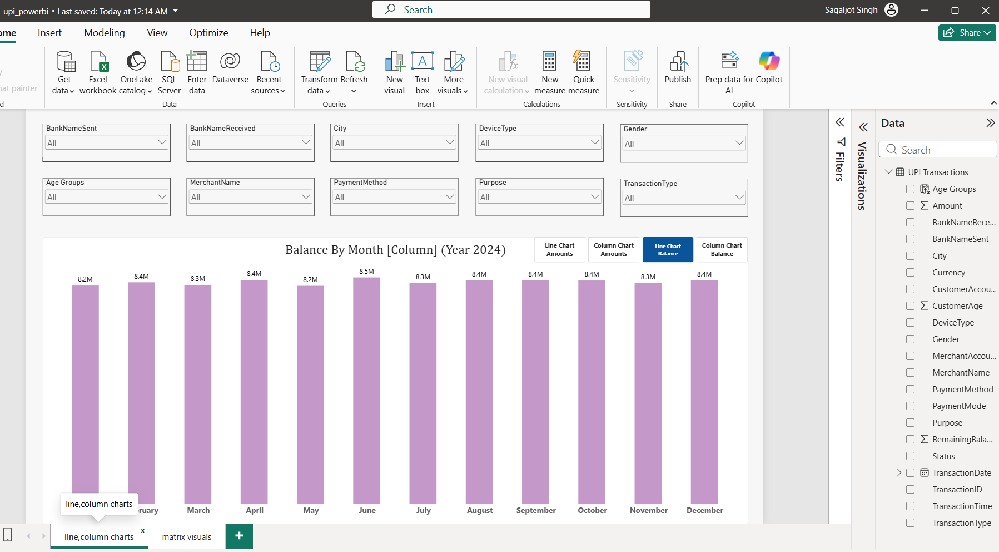
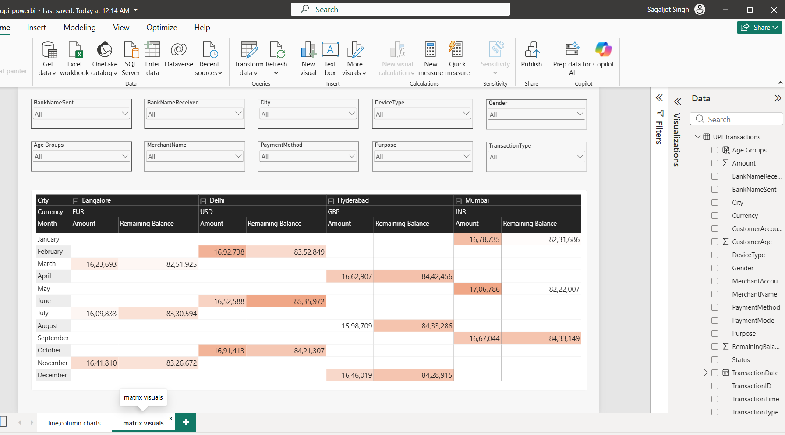

# UPI Transactions Data Analysis – Power BI

## Project Overview

This project analyzes UPI transaction data using Microsoft Power BI.
The report provides interactive analysis of transaction amounts,
remaining balances, transaction dates, cities, banks, devices,
customers, payment methods, merchants, purposes, and transaction types.

The project demonstrates data preparation, data profiling,
interactive filtering, data visualization, conditional formatting,
slicer synchronization, bookmarks, and publishing a report to
Power BI Service.

---

## Objectives

- Analyze UPI transaction amounts over time
- Analyze remaining balance trends over time
- Compare transaction data across cities and currencies
- Analyze transactions using different banks and devices
- Analyze transactions by gender and age group
- Analyze payment methods and transaction types
- Analyze merchants and transaction purposes
- Create interactive report pages using slicers
- Use bookmarks to switch between transaction and balance views
- Apply conditional formatting to matrix data
- Synchronize slicers across report pages
- Publish the report to Power BI Service

---

## Tools Used

- Microsoft Power BI Desktop
- Power Query
- Power BI Service
- Data Profiling
- Data Visualization
- Slicers
- Bookmarks
- Conditional Formatting

---

## Dataset

### Main Table

`UPI Transactions`

### Fields Used

- BankNameSent
- City
- DeviceType
- BankNameReceived
- Gender
- Age Groups
- MerchantName
- PaymentMethod
- Purpose
- TransactionType
- TransactionDate
- Amount
- RemainingBalance
- Currency

---

# Dashboard Features

## 1. Data Loading and Profiling

The UPI transaction dataset was loaded into Power BI Desktop.

Data profiling and table/data views were used to inspect the
available data before creating the report.

---

## 2. Age Group Column

An `Age Groups` field was added to categorize users by age group.

The Age Groups field is used as an interactive slicer for
age-based filtering.

---

## 3. Interactive Slicers

The report contains slicers for:

- Bank Sent
- City
- Device Type
- Bank Received
- Gender
- Age Group
- Merchant
- Payment Method
- Purpose
- Transaction Type

These slicers allow users to interactively filter the report.

---

## 4. Transaction Amount Line Chart

### Fields Used

- X-axis: `TransactionDate` – Month
- Y-axis: Sum of `Amount`

### Purpose

Shows the monthly trend of UPI transaction amounts.

---

## 5. Transaction Amount Column Chart

### Fields Used

- X-axis: `TransactionDate` – Month
- Y-axis: Sum of `Amount`

### Purpose

Provides a column-based view of transaction amounts over time.

---

## 6. Remaining Balance Line Chart

### Fields Used

- X-axis: `TransactionDate` – Month
- Y-axis: Sum of `RemainingBalance`

### Purpose

Shows the monthly trend of remaining balance.

---

## 7. Remaining Balance Column Chart

### Fields Used

- X-axis: `TransactionDate` – Month
- Y-axis: Sum of `RemainingBalance`

### Purpose

Provides a column-based view of remaining balance over time.

---

## 8. Matrix Visual

### Rows

- `TransactionDate` – Month

### Columns

- `City`
- `Currency`

### Values

- Sum of `Amount`
- Sum of `RemainingBalance`

### Purpose

Provides a detailed comparison of transaction amounts and
remaining balances across months, cities, and currencies.

---

## 9. Conditional Formatting

Conditional formatting was applied to the matrix visual to
make differences in the displayed values easier to identify.

---

## 10. Synchronized Slicers

Slicers were synchronized across the report pages so that
the selected filters can be maintained when navigating between
different report pages.

---

# Bookmarks

Four bookmarks were created to provide different analytical views:

1. Line Chart Amounts
2. Column Chart Amounts
3. Line Chart Balance
4. Column Chart Balance

A bookmark navigator was used to allow users to switch between
the different chart views.

---

# Report Pages

## Page 1 – Line, Column Charts

Contains:

- Interactive slicers
- Transaction amount line chart
- Transaction amount column chart
- Remaining balance line chart
- Remaining balance column chart
- Bookmark navigation

## Page 2 – Matrix Visuals

Contains:

- Interactive slicers
- Matrix visual
- Monthly transaction analysis
- City and currency breakdown
- Amount analysis
- Remaining balance analysis
- Conditional formatting

---

# Power BI Service

The completed Power BI report was published to Power BI Service.

The project demonstrates the workflow from Power BI Desktop
development to publishing the report in Power BI Service.

---

# Skills Demonstrated

- Data Loading
- Data Profiling
- Data Transformation
- Calculated/Derived Column Creation
- Power BI Visualizations
- Slicers
- Slicer Synchronization
- Line Charts
- Column Charts
- Matrix Visuals
- Conditional Formatting
- Bookmarks
- Bookmark Navigator
- Interactive Report Design
- Power BI Service
- Report Publishing

---

# Project Type

Guided Power BI project completed as part of my Data Analyst training.

## Dataset Source

The dataset was provided as part of the Udemy course
"Complete Data Analyst Bootcamp From Basics To Advanced"
by Krish Naik and Jayant Topnani.

The original course dataset is not redistributed in this repository.
